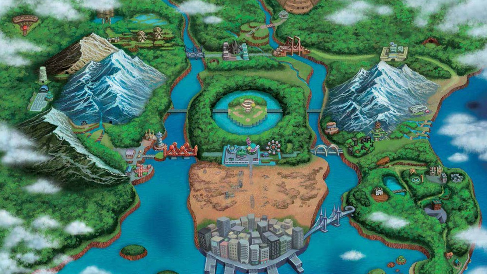
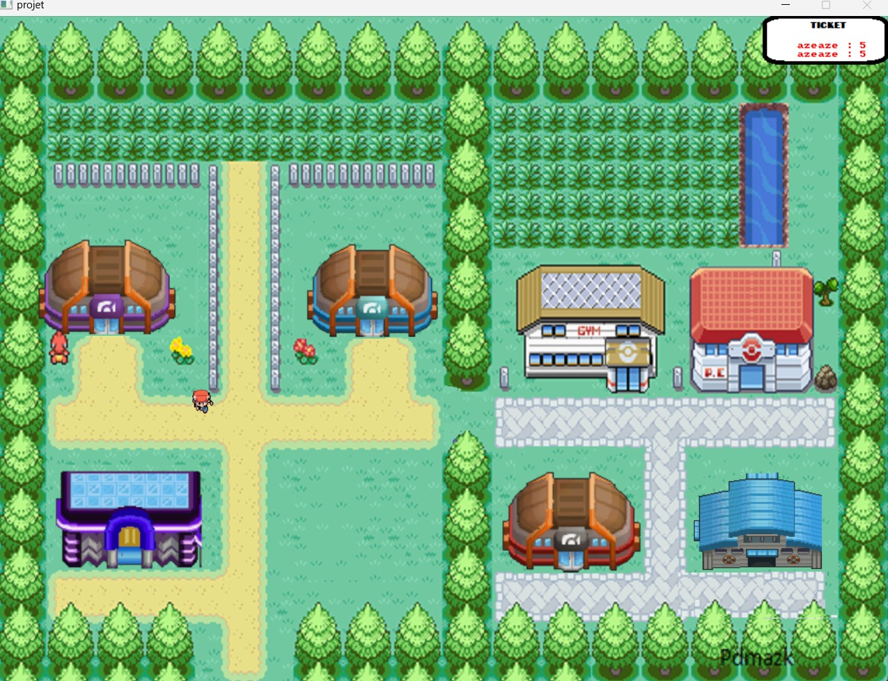
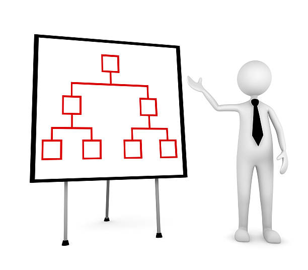
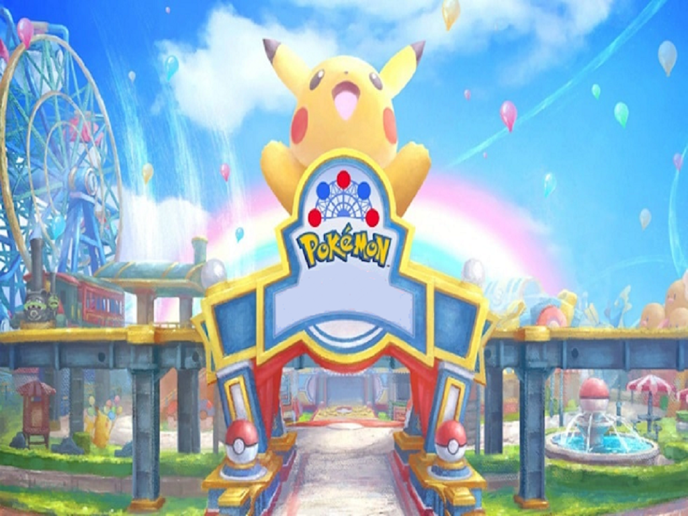
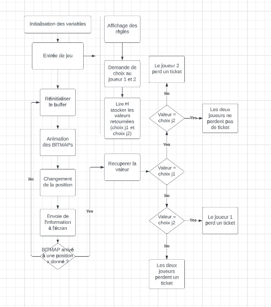
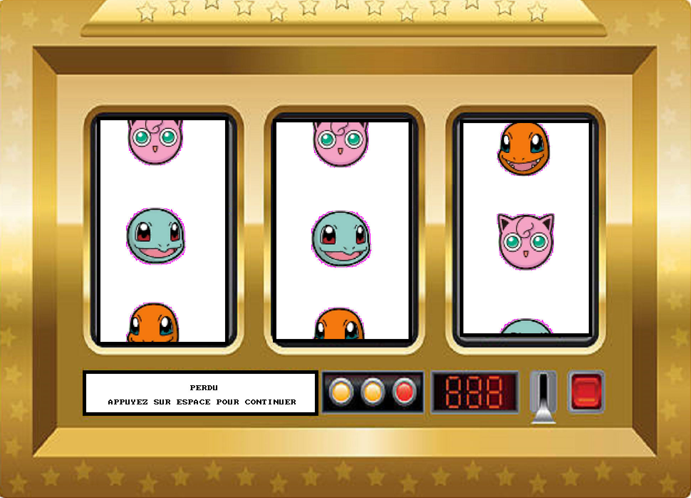
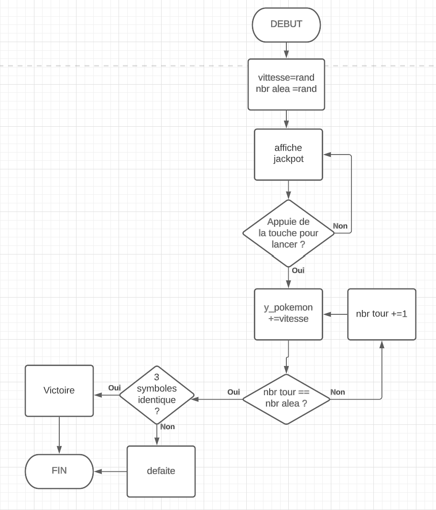
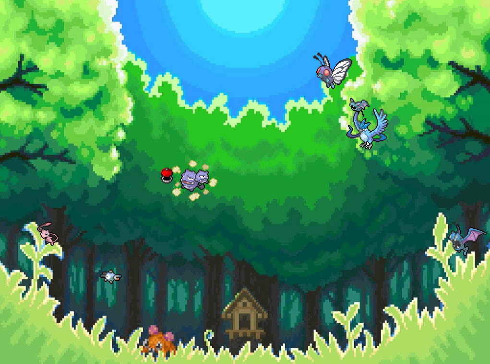

---

marp: true
theme: default
class : invert
paginate: true
_paginate: false

---

<script type="module">
  import mermaid from 'https://cdn.jsdelivr.net/npm/mermaid@10/dist/mermaid.esm.min.mjs';
    mermaid.initialize({ 
        startOnLoad: true,
        theme: 'forest',
    });
</script>

<!--
# Style lead only for this slide
_class: lead
_footer: Algorithmique Avancée et Bibliothèque Graphique - 2022-2023
-->


**ING1** Projet d'informatique


# ECE World :muscle::trident:

Equipe 57 - TD 1

---

# Equipe 57  :bangbang:


  
- Alexandre Charvet
- Matthias Aubert
- Maximiliano Berté
- Ronan Meyer-Roussilhon

---

# ECE World :circus_tent:



## Thème 

- Basé sur Pokemon gen.1 et gen.2
- Map : Pokemon
- Personnages : Pokemon

---

# <!--fit--><!--_color: black-->Carte :scroll:


---


<!--_color: black-->
# <p style="text-align: center;">Carte :sparkler: `1/2`</p>

<p style="text-align: center;"> * Les joueurs ont un personnage à choisir chacun sur deux présents</p>
<p style="text-align: center;"> * Le personnage est animé sur la carte</p>
<p style="text-align: center;"> * Saisie des noms par clavier avec readkey()</p>
<p style="text-align: center;"> * le score et le classement sont affichés ...</p>
<p style="text-align: center;"> * probleme avec un ordinateur pas assez puissant</p>

---


<!--_color: black-->
# <p style="text-align: center;">Carte :sparkler: `2/2`</p>

<p style="text-align: center;"> * La carte est le menu</p>
<p style="text-align: center;"> * les statistiques des jeux sont affichés dans le centre pokémon</p>
<p style="text-align: center;"> * Les joueurs ont 5 tickets au départ</p>
<p style="text-align: center;"> * A chaque jeu gagné par un joueur, l'autre perd un ticket</p>

---


<!--_color: red-->
# Organisation des jeux :moneybag: `1/3`

Précisez comment les jeux sont organisés ? Sont-ils dans des fichiers séparés ? Dans des dossiers ? Sont-ils éparpillés dans plusieurs fichiers ?

 - <initiale_du_jeu>_programmes.c : Tous les sous-programmes de chacun des jeux
 - <nom_du_jeu> : Programme principal appelant tous les SP d'un jeu
 - "head.h" : header commun à tous, avec des parties préfaites pour main et jeux
 - Les images sont dans des fichiers pour une meilleur lisibilité du GitHub

---


# Organisation des jeux :moneybag: `2/3`

Quels paramètres prennent les jeux ?  La file d'événement par exemple ? Ou est-ce que chaque jeu crée sa propre file ?

 - Notre jeu est organisé autour d'une structure principale :
 - structure
 - structure
 - structure

 - On envoie à chaque jeu deux pointeurs de stuctures pour joueur 1 et joueur 2 :

 <!--_color: green-->
 ```C
void jeu_random(t_player * player, t_player * player2);
 ```
---


<!--_color: white-->
# Organisation des jeux :moneybag: `3/3`

Comment on lance un jeu et comment on revient à la carte à la fin de la partie ?
 - Les jeux sont lancés avec une collision avec leurs batiments respectifs
 - Le retour à la carte est fait par la touche 'entrée'

Comment le classement est-il mis à jour ?

---

# <!--fit--><!--_color: black-->Attractions :tada:


---


# Snake :snake:

*Réalisé par : **Alexandre**.*

## Résumé :
- Un serpent avance selon les touche pressées
- l'objectif est d'atteindre les rochers pour allonger le serpent
- un nouveau rocher est géneré aléatoirement a chaque fois que le précédent est atteint
- les joueurs doivent obtenir le plus de rochers possible sans rentrer dans les bords ni en se mordant la queue

---


## Listes chainées principales :

typedef struct snake {
-       int x;
        int y;
        BITMAP* base;
        struct snake* next;
}t_snake;

typedef struct liste{
-       t_snake* head;
}t_liste;

---


# Snake :snake:
<br>

<div class="mermaid">
%%{init: {'theme':'dark'}}%%
flowchart LR
initialisation --> pomme_init --> move_snake-->collision_snake 
collision_snake --> addpart --> pomme_init
move_snake --> end_snake --> end_
 
</div>

---


# Guitar Hero :guitar:

*Réalisé par : **Matthias**.*

## Résumé :
- 5 colonnes de pokemons qui descendent
- Il faut cliquer sur les pokemons lorsqu'ils arrivent a la hauteur des boutons
- Leurs vitesses  augmentent en fonction du temp
- Defaite si un pokemon touche le bas de l'ecran
- Defaite si on clique sur un bouton alors qu'il n'y a pas de pokemon a la hauteur du bouton


---
# Guitar Hero :guitar:
## organnigramme :


---


# Guitar Hero :guitar:


## Structure maître :

<div style="margin-left: auto;
            margin-right: auto;
            width: 40%">

| int Y_pokemon |
| --- | 
| int vitesse | 
| int aleatoire | 
| BITMAP* poke | 


</div>


---

# Guitar Hero :guitar:

## Graphe d'appel :


<br>

<div class="mermaid">
%%{init: {'theme':'dark'}}%%
flowchart LR
guitare_hero --> partie_guitare_hero--> verification_touche
partie_guitare_hero-->deplacement
</div>


---


# Pari Hippique :horse_racing:

*Réalisé par : **Ronan**.*

## Résumé :
- 5 pokemons avance de gauche à droite
- Ils sont animés
- Leur déplacement est aléatoire, modifié souvent
- Les joueurs parient sur un pokemon chacun
- L'écran de fin prend un compte toutes les fins

---


# Pari Hippique :horse_racing:

## Structure maître :

<div style="margin-left: auto;
            margin-right: auto;
            width: 40%">

| Struct Pokemon |
| --- | 
| int posx, posy | 
| int depx | 
| int pok (type) | 
| int frame_act | 
| BITMAP* img[4] | 

</div>

---


# Pari Hippique :horse_racing:

## organigramme

---


# Pari Hippique :horse_racing:

<br>

<div class="mermaid">
%%{init: {'theme':'dark'}}%%
flowchart LR
Pari_Hippique --> PI_remp_tab_pok
PI_remp_tab_pok --> PI_init_pokemon
Pari_Hippique --> PI_entree_jeu
PI_entree_jeu --> PI_affichage_liste
Pari_Hippique --> PI_navigation
Pari_Hippique --> PI_navigation
PI_navigation  --> PI_choix_pok
Pari_Hippique --> PI_depla_pok
PI_depla_pok  --> PI_anim_pok
PI_print_gagnant --> PI_pok_gagnant
Pari_Hippique --> PI_print_gagnant  
</div>

---


# Taupe-la :hammer:
* Réalisé par : **Maximiliano**.
## Resumé :

* Un pokémon apparaît a une position aléatoire sur la map
* le pokemon change de position toutes les quelques secondes.
* le joueur doit utiliser sa souris et son clic gauche pour cliquer sur le pokemon lorsqu'il apparaît
* les joueurs jouent chacun leur tours 

---


# Taupe-la :hammer:

## fonctionnement génerale
### boucle while :
* variable aléatoire qui définit la position du sprite et l'affiche sur la page
* affichage d'une page blanche pour recouvrir l'ancien sprite 
* lorsque le sprite est cliqué le joueur gagne 1 point 


---


# Taupe-la :hammer:

## organigramme


---


# Taupe-la :hammer:

<br>

<div class="mermaid">
%%{init: {'theme':'dark'}}%%
flowchart LR
Finale_TP --> fond_ecran 

jeu_maximiliano-->fond_ecran-->jeu_maximiliano
 
</div> 

---


# Pierre:rock: - Feuille:page_facing_up: - Cisaux:scissors:

*Réalisé par : **Alexandre**.*

## Résumé :
- les joueurs choisissent leur pokemon chacun leur tour (uniquement esthétique)
- Une fois en combat ils sont animés
- On chois entre tranche,protect et spéciale
- Respectivement pierre,feuille et ciseaux
- Le premier a perdre 4 fois a perdu
- On peut voir combien de fois on peut encore perdre grâce a la bare de PV
---


# Pierre:rock: - Feuille:page_facing_up: - Cisaux:scissors:

## structure et programme
typedef struct t_pokemon{
    int attack1;
    int attack2;
    int attack3;
    BITMAP* sprite[2];
    BITMAP* sprite_f[2];
}pokemon;

void pfc(t_player* player1,t_player* player2);
void fight(pokemon* s,pokemon* c,BITMAP* page,t_player* player1,t_player* player2);

---

# Pierre:rock: - Feuille:page_facing_up: - Cisaux:scissors:
## Graphe d'appel :

<br>

<div class="mermaid">
%%{init: {'theme':'dark'}}%%
flowchart LR
   pfc-->fight-->pv_down-->defeat
   
</div>

---



# Jackpot :slot_machine:

*Réalisé par : **Matthias**.*

## Résumé :
- 3 colonnes de pokemons
- une colonne est composé de pokemons différent
- vitesse des colonnes aléatoires
- arret des colonnes aléatoire
- victoire s'il y a un meme item sur les 3 colonnes


---


# Jackpot :slot_machine:
## organnigramme :

---


# Jackpot :slot_machine:


## Structure maître :

<div style="margin-left: auto;
            margin-right: auto;
            width: 40%">

| Y_pokemon |
| --- | 
| int vitesse | 
| int alea | 
| BITMAP* poke | 

</div>

---

# Jackpot :slot_machine:

## Graphe d'appel :

<br>

<div class="mermaid">
%%{init: {'theme':'dark'}}%%
flowchart LR
   jackpot-->jackpot_debut-->start_jackpot
   jackpot_debut-->tournee_debut_jackpot
   jackpot_debut-->arret_tour_jackpot
   
</div>

---


# Tir aux Ballons :balloon:`1/3`

*Réalisé par : **Ronan***

## Résumé :

- 7 pokémons se déplacent sur l'écran avec une vitesse aléatoire 
- Lorsqu'on clique dessus, ils disparaissent de l'écran
- La souris est matérialisé par une pokéball qui s'ouvre et qui se ferme
- Le gagnant est celui qui attrape tous les pokémons en un temps inférieur

---



# Tir aux Ballons :balloon:`2/3`

## Structure maître :

<div style="margin-left: auto;
            margin-right: auto;
            width: 40%">

| Struct Ballons |
| --- | 
| int posx, posy | 
| int depx, depy | 
| int type | 
| int attrape | 
| BITMAP* poke | 

</div>

---


# Tir aux Ballons :balloon:

## organigramme

---


# Tir aux Ballons :balloon:`3/3`

## Graphe d'appel :

<br>

<div class="mermaid">
%%{init: {'theme':'dark'}}%%
flowchart LR
    Tir_ballons --> TB_entree_jeu
    Tir_ballons --> TB_jeu
    Tir_ballons --> TB_resultats
    Tir_ballons --> TB_entree_jeu
    Tir_ballons --> TB_jeu
    TB_jeu --> TB_remp_tab_pok
    TB_jeu --> TB_anim_pok
    TB_jeu --> TB_click_souris
    TB_jeu --> TB_condition_attrap
    TB_remp_tab_pok --> TB_init_struct 
</div>

---

# Bilan collectif

- Bonne organisation de groupe et cohésion
- Beaucoup d'amusement avec ce projet -> meilleur travail
- Découverte de nouveaux outils ( Git, Github, Marp et Paint )
- Projet concret (notre premier jeu vidéo)

---

<!--
_class: lead
-->

# Les slides suivantes ne seront pas présentées oralement lors de la soutenance mais doivent figurer dans la présentation. Nous les survolerons rapidement.

---

# Tâches réalisées (pour chaque membre) `1/2`

- `✅ 100%` Sprites / Bitmaps / Gestion avec Paint
- `✅ 90%`  Système de collision
    - Certaines collisions sont un peu mauvaises ou ne sont pas encore faites
- `✅ 75%`  Deplacement du joueur sur la map
    - Il se déplace bien, il y a en effet deux joueurs mais le mouvement en diagonal fait bugger les sprites

---

# Tâches réalisées (pour chaque membre) `1/2`

- `✅ 100%`  Lancement des mini-jeux
- `✅ 100%`  Sauvegarde du nombre de tickets
- `✅ 70%`  Records sur certains jeux
    - Les records de certains jeux ne sont pas parlants (1 ou 0 pour Pari hippique)
 - `✅ 100%`  Transition map et jeux et inversement  

---

# Investissement

<div class = "mermaid">
%%{init: {'theme':''}}%%
pie title Organisation de l'équipe
    "Maximiliano" : 20
    "Ronan" : 25
    "Matthias" : 25
    "Alexandre" : 30
</div>

---

# Récapitulatif des jeux

| Jeu | Avancement | Problèmes / reste |
| --- | --- |  --- |
| PFC | 100% | - |
| Tir aux ballons | 90% | Touche ECHAP permet de gagner le jeu |
| Guitar Hero | 100% | - |
| Pari hippique | 95% | Fond et taille des pokemons mal calibrés |
| Snake | 100% | - |
| Taupe-la | 100% | - |
| Jackpot | 100% | - |

---
